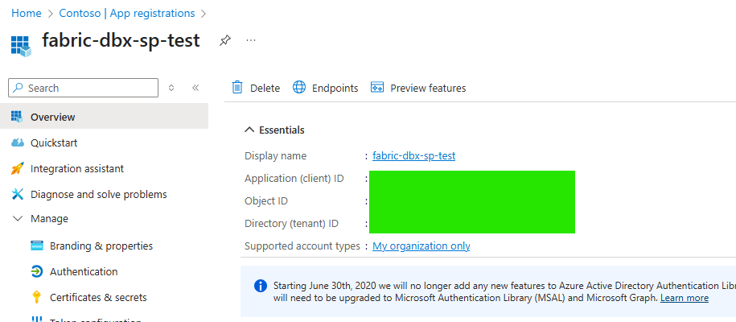

# Prerequisites in Portal/UI

These steps are carried out from the **Azure Portal & Fabric Portal**, without the need for CLI commands. Some steps could also be executed using the CLI, but for clarity we will perform them through the UI.

---

## 1. Create a Service Principal (App Registration)

1. Got to **Azure Portal → Microsoft Entra ID → App registrations → New registration**.  
2. Enter a name, for example: `fabric-dbx-sp-test`.  
3. Copy and save the following values:  
   - **Application (client) ID**  
   - **Directory (tenant) ID**  
4. Navigate to **Certificates & Secrets → New client secret**.  
   - Save the value of the secret (it is only shown once).
  
*Make sure to take note of these values, as they will be referenced later.*

---

## 2. Create a Key Vault and store the secrets

1. Go to **Azure Portal → Key Vaults → Create**.  
2. In the newly created Key Vault, navigate to **Secrets → Generate/Import**.  
3. Create the following secrets:
   
   - `fabric-tenant-id` → Tenant ID of the Service Principal.  
   - `fabric-sp-client-id` → Client ID of the Service Principal.  
   - `fabric-sp-client-secret` → Client Secret generated earlier.
  
---

## 3. Grant Databricks access to the Key Vault

1. In Azure Portal, go to **Key Vault → Access control (IAM)**.  
2. Assign the Databricks service identity (either the Managed Identity or the Enterprise App `AzureDatabricks`) the role **Key Vault Secrets User**.

---

## 4. Create a Secret Scope in Databricks

Secret Scopes provide a secure, standardized way to handle credentials (Client IDs, Client Secrets, Tenant IDs, tokens) without exposing them in notebooks, jobs, or logs.

**Key reasons**
- **Security by design**: Secrets never appear in notebook outputs, logs, or the UI; `dbutils.secrets.get` redacts values automatically.
- **No secrets in code or repos**: Avoids hard-coding credentials in notebooks, init scripts, or Git history.
- **Centralized management**: When backed by Azure Key Vault, you gain versioning, expiry, soft delete, RBAC, and rotation policies.
- **Least privilege & RBAC**: Grant read-secrets only to the workspace identity; developers run code without direct access to raw credentials.

The creation of Secret Scopes does not appear in the standard workspace settings menu.
You must access it through a hidden **URL** or via the **CLI/API**.

### Option 1 — URL
1. Open your browser, go to your Databricks workspace URL, and add the following suffix after your Workspace ID: **#secrets/createScope/**

`https://<tu-workspace>.azuredatabricks.net/#secrets/createScope/`

3. Complete the form:  
- **Scope name:** for example `kv-dbx`  
- **Manage principal:** `All users` (or restricted, according to your policy)  
- **Azure Key Vault**:  
  - DNS Name: `https://<nombre-kv>.vault.azure.net/`  -- you can copy this from the **Properties** blade of the Key Vault in Azure Portal (this is the Vault URI).
  - Resource ID: you can also copy this from the **Properties** blade of the Key Vault in Azure Portal.

### Option 2 — CLI/API
You can also create the Secret Scope with `databricks secrets create-scope` or via the REST API.  

---

## 5. Assign permissions in Fabric to the Service Principal

1. Go to **Fabric Portal → Workspace**.  
2. In the **Warehouse** or **Lakehouse**, select **Manage Access → Add people or groups**.  
3. Search for the Service Principal by name or Client ID.  
4. Assign an access role, for example:  
   -  *Member/Contributor*.  
   

---
