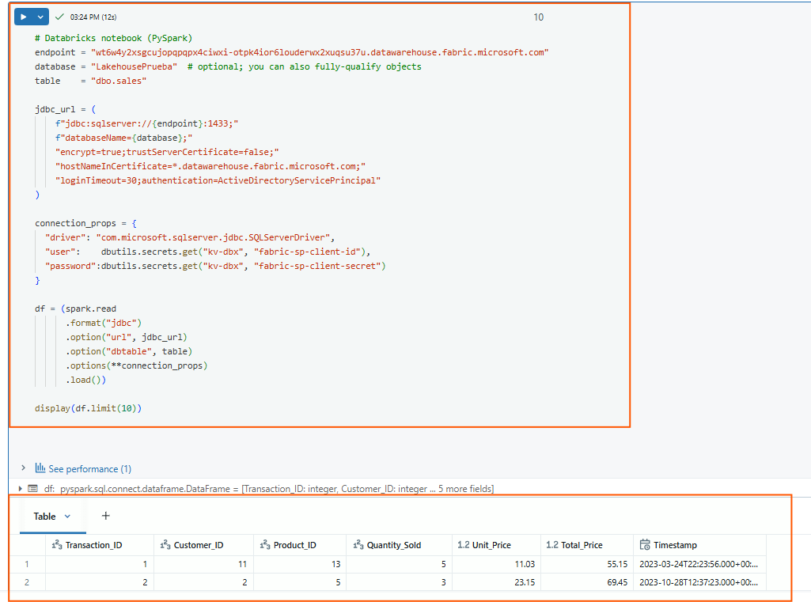

# Conexión al SQL Endpoint de Fabric desde Databricks

## 🎯 Objetivo
Conectarse desde Databricks a un **Warehouse (SQL Endpoint)** de Microsoft Fabric usando **Service Principal** y el **driver JDBC**.

---

## 🚦 Cuándo usar SQL Endpoint
- Para **consultas T-SQL** tradicionales.  
- Para integrarte con **Power BI** o **SSMS**.  
- Cuando quieras aprovechar un **catálogo SQL centralizado**.

---

## ✅ Requisitos
- Prerrequisitos completados → [Ver documento](00-prerequisitos.md).  
- Databricks clustercon el driver JDBC instalado (`com.microsoft.sqlserver:mssql-jdbc`). Viene pre-instalado en el cluster classic y en serverless  
- Salida a internet hacia `*.datawarehouse.fabric.microsoft.com:1433`.

---

## 🔐 Código en Databricks Notebook

```python
# ---------------------------------------
# 1. Configurar variables
# ---------------------------------------
endpoint = "<tu-endpoint>.datawarehouse.fabric.microsoft.com"  # ej: abcd1234.datawarehouse.fabric.microsoft.com
database = "<tu-warehouse>"  # nombre del Warehouse
table    = "dbo.<tu-tabla>"       # tabla de ejemplo, o en el schema donde se encuentre

# ---------------------------------------
# 2. Construir la cadena JDBC
# ---------------------------------------
jdbc_url = (
    f"jdbc:sqlserver://{endpoint}:1433;"
    f"databaseName={database};"
    "encrypt=true;trustServerCertificate=false;"
    "hostNameInCertificate=*.datawarehouse.fabric.microsoft.com;"
    "loginTimeout=30;authentication=ActiveDirectoryServicePrincipal"
)

# ---------------------------------------
# 3. Propiedades de conexión
#    - user = Client ID del SP
#    - password = Client Secret del SP
#    Ambos se leen desde el Secret Scope
# ---------------------------------------
connection_props = {
    "driver": "com.microsoft.sqlserver.jdbc.SQLServerDriver",
    "user": dbutils.secrets.get("kv-dbx", "fabric-sp-client-id"),
    "password": dbutils.secrets.get("kv-dbx", "fabric-sp-client-secret"),
}

# ---------------------------------------
# 4. Leer datos desde el SQL Endpoint
# ---------------------------------------
df = (spark.read
      .format("jdbc")
      .option("url", jdbc_url)
      .option("dbtable", table)
      .options(**connection_props)
      .load())

display(df.limit(10))

```



---

## 📌 Nota sobre red

- Se requiere salida a internet hacia *.datawarehouse.fabric.microsoft.com por puerto 1433.

- Si tu workspace es NPIP o VNet-injected, asegúrate de que exista egress permitido (configurado por tu equipo de red).

- Este escenario utiliza computo de tipo "classic" en Databricks. Si se utiliza "serverless" considerar que no es posible instalar librerias a traves de JAR files, afortunadamente la libreria de JDBC para SQL Server que      permite conversar con Fabric esta pre-empaquetada en el runtime del serverless cluster de Databricks por lo que no representa un blocker.
