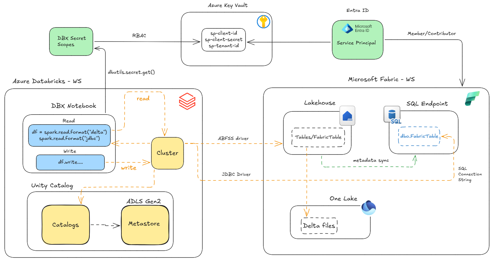

# Connecting to the Fabric SQL Endpoint from Databricks

## 🎯 Objetive
Connect from Databricks to a **SQL Analytics Endpoint)** of Microsoft Fabric using a **Service Principal** and the **JDBC driver**.

---

This approach allows Databricks to connect to the Microsoft Fabric SQL Analytics Endpoint just like a classic SQL Server. It uses the **SQL Server JDBC driver** and a Service Principal for authentication. This is ideal for scenarios where you need to run **T-SQL queries**, leverage the centralized catalog and roles in Fabric, or integrate with tools such as **Power BI and SSMS**.



---

## 🚦 When to Use SQL Endpoint
- For traditional **T-SQL queries**.  
- For integration with **Power BI** or **SSMS**.  
- When you want to leverage a **centralized SQL catalog**.

---

## ✅ Requirements
- Prerequisites completed → [See document](00-prerequisitos.md).  
- Databricks cluster with the JDBC driver installed (`com.microsoft.sqlserver:mssql-jdbc`). It comes pre-installed in classic clusters and serverless clusters.
- The SQL Analytics Endpoint connection string: obtained inside the SQL Endpoint --> ⚙️settings --> SQL Endpoint --> **SQL connection string**
- Outbound internet access from the Databricks cluster to `*.datawarehouse.fabric.microsoft.com:1433`.

---

## 🔐 Code in Databricks Notebook

```python
# ---------------------------------------
# 1. Config variables
# ---------------------------------------
endpoint = "<your-endpoint>.datawarehouse.fabric.microsoft.com"  # ej: abcd1234.datawarehouse.fabric.microsoft.com
database = "<your-warehouse>"  # name of the Warehouse/Lakehouse
table    = "dbo.<your-table>"       # your source table 

# ---------------------------------------
# 2. Build the JDBC connection string
# ---------------------------------------
jdbc_url = (
    f"jdbc:sqlserver://{endpoint}:1433;"
    f"databaseName={database};"
    "encrypt=true;trustServerCertificate=false;"
    "hostNameInCertificate=*.datawarehouse.fabric.microsoft.com;"
    "loginTimeout=30;authentication=ActiveDirectoryServicePrincipal"
)

# ---------------------------------------
# 3. Connection properties
#    - user = Service Principal Client ID
#    - password = Service Principal Secret
#    Both are read from the Secret Scope
# ---------------------------------------
connection_props = {
    "driver": "com.microsoft.sqlserver.jdbc.SQLServerDriver",
    "user": dbutils.secrets.get("kv-dbx", "fabric-sp-client-id"),
    "password": dbutils.secrets.get("kv-dbx", "fabric-sp-client-secret"),
}

# ---------------------------------------
# 4. Read data from the SQL Endpoint
# ---------------------------------------
df = (spark.read
      .format("jdbc")
      .option("url", jdbc_url)
      .option("dbtable", table)
      .options(**connection_props)
      .load())

display(df.limit(10))

```


---

## 📌 Network Note

- Outbound internet access is required to *.datawarehouse.fabric.microsoft.com over port 1433.

- If your workspace is NPIP or VNet-injected, make sure egress is allowed (configured by your networking team).

- This scenario uses classic compute in Databricks. If serverless is used, note that it is not possible to install libraries via JAR files. Fortunately, the SQL Server JDBC driver required to connect to Fabric is pre-        packaged in the Databricks serverless cluster runtime, so this does not represent a blocker.
