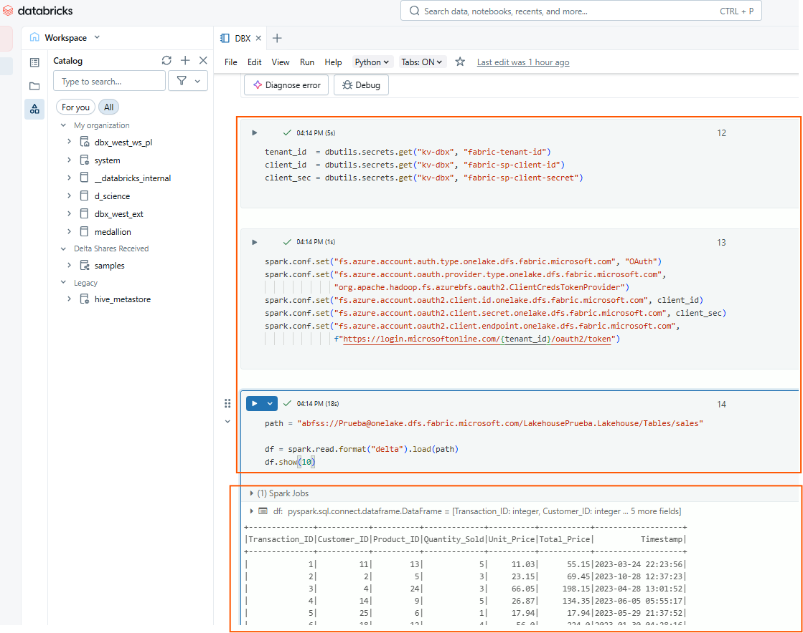

# Connecting to the Fabric Lakehouse from Databricks (ABFS/Delta)

## 🎯 Objetive
Read (and optionally write) Delta tables from **Fabric Lakehouse** in Databricks using a **Service Principal** & **OAuth Client Credentials** sobre ABFS/HTTPS.

---

This approach connects Databricks directly to the Fabric Lakehouse through OneLake, using the ABFS protocol over HTTPS and OAuth authentication with a Service Principal. It is the best option for large-scale data processing, ETL, or Machine Learning, since it allows direct read and write operations on Delta files stored in OneLake, optimized for Spark.


---

## 🚦 When to Use Lakehouse
- For **Machine Learning** or **ETL** in Databricks on **Delta Tables**. It allows accessing data resources across platforms.
- When you want to access Delta files directly without going through the SQL Endpoint, using a DataFrame API such as PySpark.
- When you prefer to use only **HTTPS/443**.

---

## ✅ Requirements
- Prerequisites completed → [See document](00-prerequisitos.md).  
- Outbound internet access to `onelake.dfs.fabric.microsoft.com:443`.

---

## 🔐 Code in Databricks Notebook

```python
# ------------------------------------------------
# 1. Retrieve SP secrets from the Secret Scope
# ------------------------------------------------
tenant_id  = dbutils.secrets.get("kv-dbx", "fabric-tenant-id")
client_id  = dbutils.secrets.get("kv-dbx", "fabric-sp-client-id")
client_sec = dbutils.secrets.get("kv-dbx", "fabric-sp-client-secret")

# ---------------------------------------
# 2. Spark configuration for OAuth
# ---------------------------------------
spark.conf.set("fs.azure.account.auth.type.onelake.dfs.fabric.microsoft.com", "OAuth")
spark.conf.set("fs.azure.account.oauth.provider.type.onelake.dfs.fabric.microsoft.com",
               "org.apache.hadoop.fs.azurebfs.oauth2.ClientCredsTokenProvider")
spark.conf.set("fs.azure.account.oauth2.client.id.onelake.dfs.fabric.microsoft.com", client_id)
spark.conf.set("fs.azure.account.oauth2.client.secret.onelake.dfs.fabric.microsoft.com", client_sec)
spark.conf.set("fs.azure.account.oauth2.client.endpoint.onelake.dfs.fabric.microsoft.com",
               f"https://login.microsoftonline.com/{tenant_id}/oauth2/token")

# ---------------------------------------
# 3. Define ABFS path
#    - Copy the ABFS path of the table(s) from Fabric (UI → Table Menu → Properties → "ABFS path")
# ---------------------------------------
path = "abfss://<LakehouseName>@onelake.dfs.fabric.microsoft.com/<WorkspaceName>.Lakehouse/Tables/<TableName>"

# ---------------------------------------
# 4. Read Delta data from the Lakehouse
# ---------------------------------------
df = spark.read.format("delta").load(path)
df.show(10)

```



---

## 📌 Network Note

- If your workspace is NPIP or VNet-injected, make sure that egress is allowed (configured by your networking team).
- This scenario will **not work on serverless clusters**, since they do not support the required `spark.conf` settings. Use a classic or pro cluster instead.
